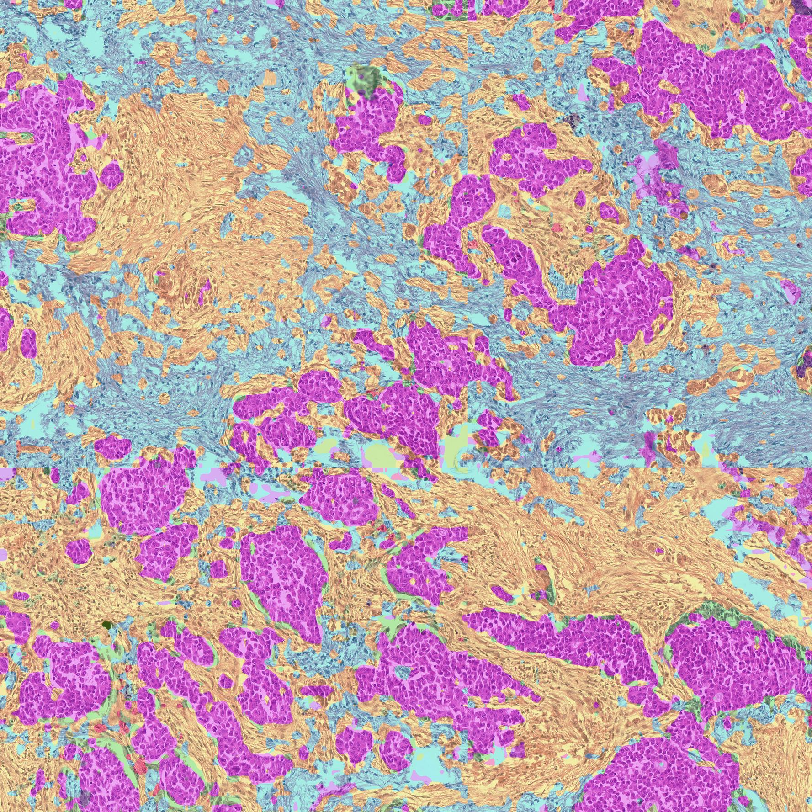

# F-Seg: Deep Feature Factorization for Image Segmentation

F-Seg is a Python library that implements Deep Feature Factorization (DFF) for image segmentation tasks. This method leverages the power of deep neural networks and non-negative matrix factorization to produce meaningful segmentations of images.


F-Seg offers powerful image segmentation capabilities. Here's an example of what it can do:




## Installation

To install F-Seg, you can use pip:

```bash
pip install fseg
```

## Usage

To use F-Seg in your project, follow these steps:

1. Import the library:

```python
from fseg import FSeg
```

2. Load a pre-trained model and prepare the input image:

```python
from huggingface_hub import login


token = "<your_token>"
login(token=token)


class TransformerReshapeTransform:
    def __init__(self):
        self.input_tensor_shape = None

    def __call__(self, tensor):
        result = torch.nn.ReLU()(tensor[:, 1:, :].reshape(tensor.size(0),
                                self.input_tensor_shape[2] // 16,
                                self.input_tensor_shape[3] // 16,
                                tensor.size(2)))
        # Bring the channels to the first dimension,
        # like in CNNs.
        result = result.transpose(2, 3).transpose(1, 2)
        return result


model = timm.create_model(
    "hf-hub:MahmoodLab/uni", pretrained=True, init_values=1e-5, dynamic_img_size=True)
target_layer = model.blocks[-1]    
transform = TransformerReshapeTransform()

unsupervised_seg = FSeg(
    model=model,
    target_layer=target_layer,
    reshape_transform=reshape_transform
)

img_path = "<path_to_image>"
img = np.array(Image.open(img_path))[:, :, :3]
orig_shape = img.shape
img = pad_divisible(img)
rgb_img_float = np.float32(img) / 255
input_tensor = preprocess_image(rgb_img_float,
                                mean=[0.485, 0.456, 0.406],
                                std=[0.229, 0.224, 0.225])
```

3. Load pre-computed model embeddings:

```python
model_embeddings = np.load("./model_embeddings/uni.joblib")
```

4. Define the number of clusters and prepare the concepts:

```python
k = 64  # Number of clusters
concepts = model_embeddings[k]
```

5. Generate the segmentation prediction:

```python
segmentation_prediction = unsupervised_seg.predict_project_concepts(input_tensor, concepts)
```


## License and Terms of Use

This project is licensed under the Apache License, Version 2.0. You can find the full text of the license in the LICENSE file in the root directory of this project or at http://www.apache.org/licenses/LICENSE-2.0

Please ensure that you comply with the terms of the license when using, modifying, or distributing this software.


## Citation

If you use this code in your research, please cite using this BibTeX:

```
@article{gildenblat2024segmentation,
  title={Segmentation by Factorization: Unsupervised Semantic Segmentation for Pathology by Factorizing Foundation Model Features},
  author={Gildenblat, Jacob and Hadar, Ofir},
  journal={arXiv preprint arXiv:2409.05697},
  year={2024}
}
```
